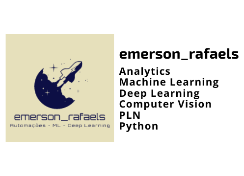
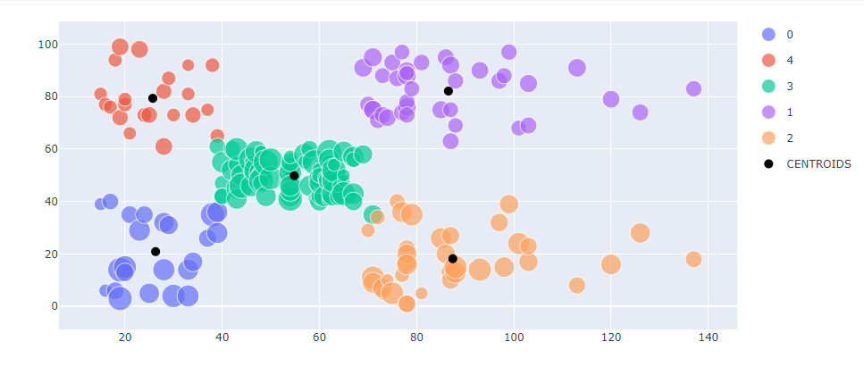

<h1 align="center">
    
</h1>

<h4 align="center"> 
	[∑] KMeans - Mall Customers 🚀 Data Science
</h4>

  

  

  	
  
	
  
  

  
   

## 💻 About the project

 - Area: Data Science
 - Type: Unsupervised Learning
 - Algorithm: KMeans
 - Dataset: [Mall Customers](https://www.kaggle.com/datasets/shwetabh123/mall-customers)

The project has:

1. Exploratory Analysis
2. Elbow method for making optimal K
3. Application of Kmeans with optimal K
4. Plot with clusters and centroids
5. Analysis of results

<h1 align="center">
    
</h1>

## 🛠  Technologies

The following tools were used in building the project

- [Python]

## ➊ Prerequisites

Before starting, you will need to have the following tools installed on your machine (Download can be performed from the Python or Anaconda):
[Python](https://www.anaconda.com/products/individual).

## 📝 License

This project is under the MIT license.

Made with ❤️ by **Emerson Rafael** 👋🏽 [Entre em contato!](https://www.linkedin.com/in/emerson-rafael/)

[Python]: https://www.python.org/downloads/